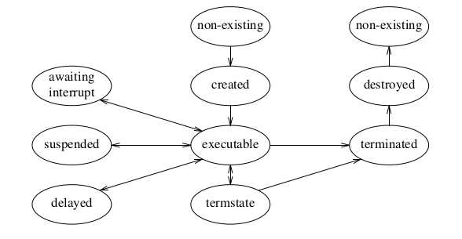

# Referencias Rapidas

Esta es una referencia ultra liviana de los componentes principales de PascalFC debe descartarse como referencia principal para cualquier busqueda profunda referirse a:
  - [Manual del Lenguaje](./pascal-fc_manualdelenguaje.pdf)
  - [Guía de Usuario](./pascal-fc_guiaUsuario.pdf)

# Ciclo de vida de un proceso



## creación

un proceso se crea con su definicion formal.

```pascal
// sintaxix de la definicion de un proceso

process type <nombre>[argumentos];
begin
  secuencia de instrucciones
end;

// ejemplo

process type proceso;
begin
  writeln('soy un proceso');
end;
```

## ejecución

un proceso entra en estado ejecutable cuando se hace define una variable y se realiza la invocación de la misma.

```pascal
// programa principal
var
proceso_1 : proceso;
begin
cobegin
  proceso_1;
coend;
end;
```

# Semaforos

Los semaforos se deben definir en la  seccion `var`.

NOTES

1. Los semaforos o los objetos que los contengan solo pueden declararse en una seccion `var` global.
2. Los semaforos pueden pasarse como parametros a subprogramas, pero deben pasarse por referencia con el indetificador `var` correspondiente.
3. Semaphores are guaranteed to have no processes blocked on them initially, but the value is undefined until the semaphore has been passed to the initial procedure.

## Declaracion y operaciones

```pascal
// Declaracion de un semaforo 
// var <semaphore_name> = semaphore;
var semaforoVar = semaphore;

// Inicializacion
//  initial(<semaphore_name>,<valor>)
initial(semaforoVar, 0);

// Wait
//wait(<semaphore_name>)
wait(semaforoVar);

// Signal
//signal(<semaphore_name>)
signal(semaforoVar);
```

# Otras Referencias rapidas

```pascal
// declaracion de un array
// array index_type{index_type} of type
var p: array[1..max] of proc;
```
