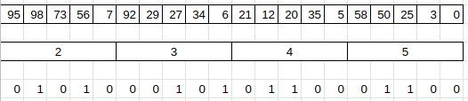

# ejercicio 5

## Enunciado

Crear un algoritmo que distribuya un vector *"Global"* de tamaño NP(cantidad de procesos lanzados) \* 5 entre los procesos lanzados `MPI_Scatter`. 

Cada proceso va a recibir los valores en un vector *"Local"* de tamaño 5. Cada proceso debe recorrer el vector y modificarlo escribiendo en cada posición, un 1 si el elemento de esa posición es multiplo del rango del proceso + 2  y un 0 si no lo es.

Luego todos los vectores *"Locales"* se unificarán en el proceso 0 `MPI_Gather`.

## Objetivos

- Aprender a usar `MPI_Scatter`.
- Aprender a usar `MPI_Gather`.