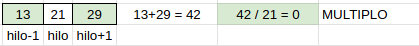
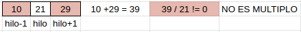

# ejercicio 3

## Enunciado

Dado un vector de tamaño `NH`, realizar un algoritmo que lance `NH` hilos. Cada hilo debe comprobar si la suma de  los elementos (izquierdo y derecho) del vector en la posicion `hilo` es multiplo del elemento en la posicion `hilo`_(Ojo! Con los extremos inferior y superior)_. 

 

se debe imprimir por pantalla el resultado.

una vez resuelto el ejercicio.

## Tareas

1. Definir una variable de alcance global `totalMultiplos`
2. Definir a nivel de bloque `#omp paralell` la clausula de comparticion `reduction(+:totalMultiplos)`
3. Si la suma de los vecinos es multiplo del elemento en la posicion `hilo` setear la variable `totalMultiplos` en 1
4. fuera de la region paralela imprimir la variable `totalMultiplos` que valor tiene? ¿Por qué?